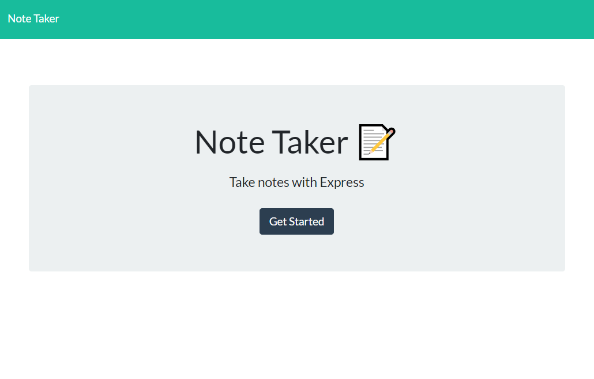
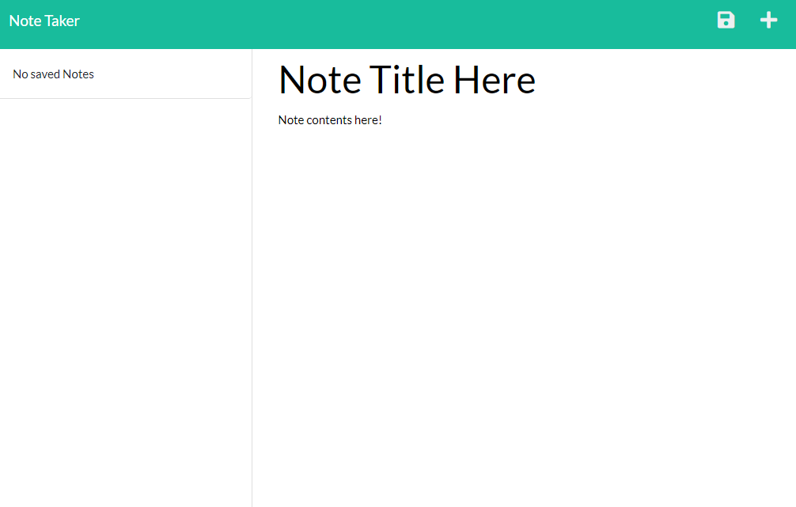
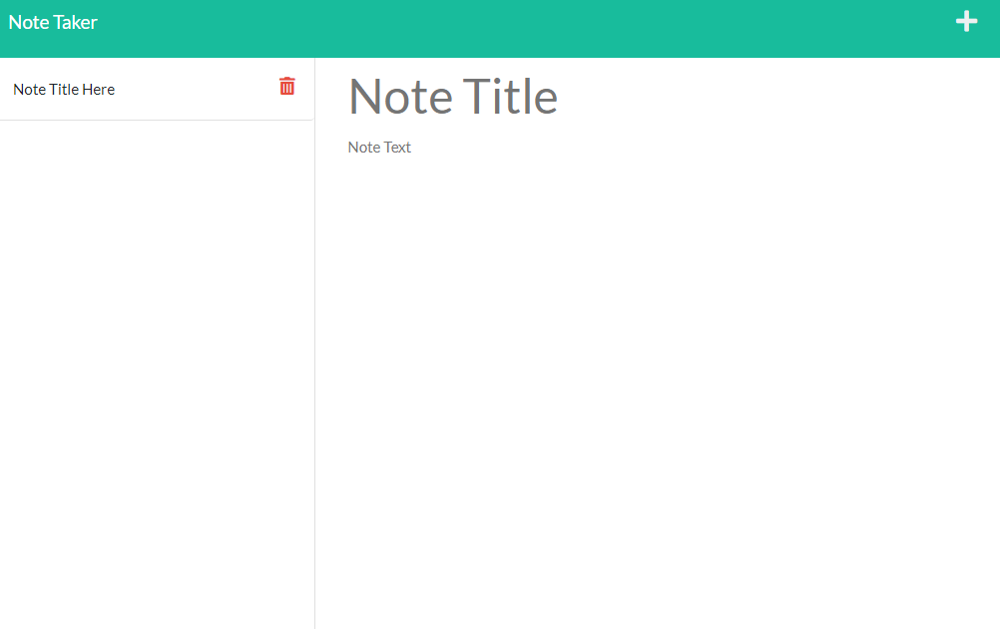

# Note Taker App 

    

## Description

This is an application that allows notes to be drafted and saved to a JSON database within the repo. This is built using Express.JS. 
The application is deployed here: 

[Note Taker App](link)

## Table of Contents

[Installation](#installation)

[License](#license)

[Features](#features)

[Credits](#credits)

[Tests](#tests)

[Contact Me](#contact-me)

## Installation

 If dependencies are not installed, the application will not run locally. Deployed code should be functional with no installation requirements.

## License: 

This project is licensed under the MIT License 

---

## Features: 

The landing page of the app appears like: 

The user can select "Get Started" to navigate to the note application.
The user then inputs the required note title and note content to have the save button appear in the right hand top corner of the page. Select this icon to save the note.

Notes then populate on the sidebar. These notes my be clicked on to view again - if the user would like to make a new note from an existing note, they may click the "+" icon in the corner to have a new note become available.

The user may also delete notes after they are no longer needed by clicking on the delete icon,

## Credits: 

Created by Brisco Arechederra

## Contact Me: 

If you'd like to contact me, please reach out to my github or email!
 
[My Github](https://github.com/brisco13)

[My Email](mailto:brisco.arch@gmail.com)